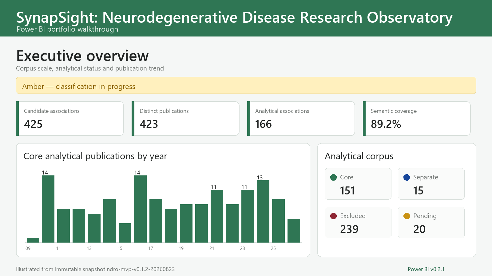

# NDRO Power BI portfolio

The NDRO Power BI report is the read-only communication layer of the
SynapSight Neurodegenerative Disease Research Observatory. It translates a
versioned scientific snapshot into an accessible analytical product for BI
reviewers, funding agencies and decision makers, while the
[Streamlit application](https://synapsight-ndro.streamlit.app/) remains the
public scientific interface and the only place that accepts community audit
reports.

[Download NDRO Power BI portfolio v0.2.1](downloads/NDRO_PowerBI_Portfolio_v0.2.1.zip)

> This short walkthrough is rendered from the same immutable snapshot to make
> the portfolio easy to preview on GitHub. The downloadable PBIP project is the
> authoritative implementation.

## Product at a glance

| Component | Released version |
|---|---|
| Power BI desktop and mobile report | `v0.2.1` |
| Paired Streamlit application | `v0.2.0` |
| Immutable snapshot | `ndro-mvp-v0.1.2-20260823` |
| Snapshot contract | `public-snapshot-v0.1` |
| Package SHA-256 | `fa83978f72bca47f7fae6387c275c24bd348ff8d82b58d568b8dffe1276f1e41` |

Reference snapshot metrics: 425 candidate associations, 423 distinct PubMed
records, 151 core associations, 15 separate-view associations, 239 exclusions,
20 pending associations, 166 completed semantic records and 89.2% semantic
coverage of the eligible analytical denominator.

## Report experience

The seven public report pages cover:

1. **Overview** — corpus scale, analytical status and annual trends.
2. **Disease Trends** — annual and cumulative evidence patterns.
3. **Geographic Coverage** — reported country context, ranking and matrix.
4. **Exclusion Analysis** — transparent inclusion and exclusion accounting.
5. **Record Audit** — searchable row-level metadata and provenance.
6. **Methodology & Data Quality** — release identity, scientific boundaries and
   validation checks.
7. **Planned Updates** — the versioned analytical roadmap.

An additional **99 QA Validation** page supports internal release checks. The
accepted mobile layouts contain 49 visual configurations across the seven
public pages.

## BI and engineering decisions

- The report is distributed as a Power BI Project (`.pbip`), exposing the
  semantic model, Power Query transformations, DAX measures, relationships,
  report definitions and mobile layouts as inspectable text.
- Power Query validates required fields and snapshot identity before refresh.
- The analytical measures distinguish candidate, core, separate-view,
  excluded and pending associations and disclose the denominator used for
  semantic coverage.
- Public-facing controls use full disease names wherever the available layout
  permits, reducing ambiguity for non-specialist users.
- Power BI is deliberately read-only. Community corrections are submitted and
  privacy-minimized through the Streamlit application.
- Both interfaces consume the same immutable release snapshot so visual
  differences cannot silently become data-version differences.

## Reproducible review

The ZIP includes the full PBIP project, its frozen public snapshot, opening
instructions, licensing notes, a validation report and a SHA-256 manifest for
every packaged file. Local Power BI cache files and workstation-specific paths
are excluded.

To review it:

1. Extract the ZIP to `C:\NDRO_PORTFOLIO`.
2. Open `NDRO_PowerBI_MVP_v0.2.1.pbip` in Power BI Desktop.
3. If prompted, set the `SnapshotFolder` parameter to the bundled
   `data\ndro-mvp-v0.1.2-20260823\` directory and refresh.

The default parameter already points to
`C:\NDRO_PORTFOLIO\data\ndro-mvp-v0.1.2-20260823\`; it does not retain a
personal workstation path.

## Scientific and licensing boundary

The snapshot is a reproducible public derivative of the NDRO PostgreSQL source.
Published correspondence e-mail addresses are masked. NDRO does not relicense
PubMed-derived titles, abstracts or other third-party fields; detailed terms
are included in `DATA_LICENSE.md` and `ASSET_AND_LICENSE_NOTES.md` inside the
package.

